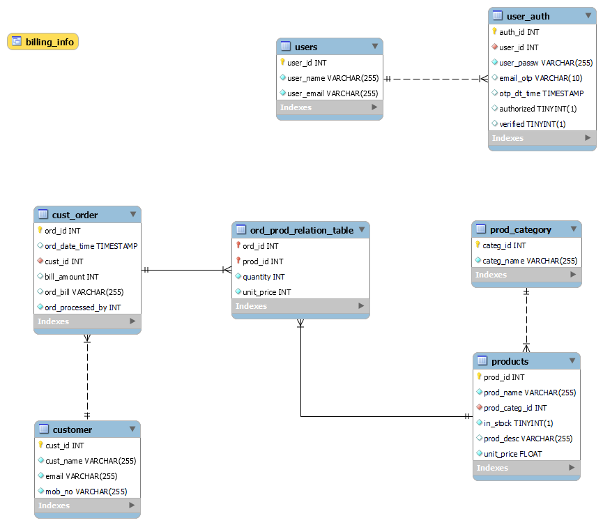

# Cafe-Management-System

End to end cafe management system using NodeJs Express, MySql, ejs, HTML, CSS and JavaScript

It's an end to end Cafe Management System Web-Application with backend. I got inspiration to work on this project when I happened to visit a night canteen in my college and I saw their Billing-System. I was a desktop-app. Using my `web development` skills I developed this project within `24 days to complete` a working version of this project. Later I made some `functionality and UI improvements` as well as some `bug fixes`.

This project gave me a greate learning curve on implementing my theoretical skills which i learning throughout my web development journey.

### Features:

* User can `SignUp`
* Then user will receive an `OTP` on his email
* Then user will `verify account` using `OTP`
* Then `admin` will `authorize` that `new user`
* Now user can `login`
* User will see a `Dashboard` screen

### User Interactions:

* **Admin Dashboard:** it will show number of `Total Category` `Total Product` `Total Order`
* **Manage Products:** here user can `add new products` `search Products` `delete products` `edit products` `update stock of products`
* **Create Order:** here user can create a fresh new Order
* **View Bills:** here user can see Bills of Order created `search Bills`
* **Manage Category:** here user can `add new Category` `delete Category` `search for Categories`

### Technical Features:

* Password hashing using `bcrypt.js`
* Account verification using `OTP`
* Session Management using `Cookies` and `jsonwebtoken`
* Every route is protected and only authorized and authenticated user will be able to make any changes

## Tech Stack Used

**Client:** HTML, CSS, JavaScript, ejs

**Server:** Node, Express, MySql

## Run Using Docker Container:
 * Download and install docker-desktop
 * In the root directory of the project(root directory has `package.json` file), run command:

 ```cmd
   docker-compose up -d
 ```
 * To stop the container:
 
 ```cmd
   docker-compose down
```

## Before you Run Locally

* Working fine for:

  * Node Version: v18.16.0
  * NPM Version: 9.5.1
  * Server version: 8.0.31 MySQL Community Server - GPL
* Download and install **[NodeJs](https://nodejs.org/en/download)**
* Download and install **[Git](https://git-scm.com/downloads)**
* Download and install **[MySql](https://dev.mysql.com/downloads/installer/)**

## Database:



* Open `MySql Command Line Client` login and run the following MySql Script to create and setup database used in the project:

```sql
-- drop ayushcafe DATABASE if it not exists:
DROP DATABASE if exists ayushcafe;
-- CREATE ayushcafe DATABASE:
CREATE DATABASE ayushcafe;
-- use ayushcafe DATABASE:
USE ayushcafe;
-- CREATE users table:
CREATE table if not exists users(
   user_id int not null auto_increment,
   user_name VARCHAR(255) not NULL,
   user_email VARCHAR(255) not NULL unique,
   constraint pk_user_id primary key(user_id)
);
-- INSERT data into users:
-- insert into users(user_id, user_name, user_email, mob_no)
-- values (
--       1,
--       "Ayush Raj",
--       "ayushjnv25@gmail.com",
--       "1234567890"
--    );
-- CREATE user_auth table:
CREATE TABLE IF NOT EXISTS user_auth(
   auth_id int not NULL auto_increment,
   user_id int unique not NULL,
   user_passw varchar(255) not null,
   email_otp VARCHAR(10) default null,
   otp_dt_time TIMESTAMP default CURRENT_TIMESTAMP on UPDATE CURRENT_TIMESTAMP,
   authorized bool default 0,
   verified bool default 0,
   constraint pk_auth_id primary key(auth_id),
   -- CONSTRAINT fk_auth_id_of_user_id FOREIGN KEY (user_id) REFERENCES users(user_id) ON DELETE CASCADE ON UPDATE CASCADE
   CONSTRAINT fk_auth_id_of_user_id FOREIGN KEY (user_id) REFERENCES users(user_id) ON DELETE CASCADE ON UPDATE CASCADE
);
-- INSERT data into user_auth:
insert into user_auth(user_id, user_passw, authorized, verified)
values (1, "12345", true, true);
-- CREATE customer table:
create table if not exists customer(
   cust_id int not null auto_increment,
   cust_name varchar(255) not null,
   email varchar(255) not null,
   mob_no varchar(255) not null,
   constraint pk_cust_id primary key (cust_id)
);
-- INSERT data into customer:
-- insert into customer(cust_name, email, mob_no)
-- values (
--       "Anurag Upadhyay",
--       "anurag@gmail.com",
--       "7894561230"
--    );
-- CREATE prod_category table:
create table if not exists prod_category(
   categ_id int not null auto_increment,
   categ_name varchar(255) not null unique,
   constraint pk_categ_id primary key (categ_id)
);
-- INSERT data into prod_category:
insert into prod_category (categ_name)
values ("COLD DRINKS"),
   ("LASSI"),
   ("ICE-CREAMS"),
   ("BEVERAGES"),
   ("NOODLES"),
   ("BURGER"),
   ("INDIAN BREAD"),
   ("RICE"),
   ("SALAD"),
   ("MILK SHAKES"),
   ("EGG"),
   ("ROLLS"),
   ("SANDWICHES"),
   ("SOUP"),
   ("PAV SPECIAL"),
   ("JUICES"),
   ("BIRYANI");
-- CREATE products table:
create table if not exists products(
   prod_id int not null auto_increment,
   prod_name varchar(255) not null unique,
   prod_categ_id int not null,
   in_stock bool not null,
   prod_desc varchar(255) default 'best selling',
   unit_price float not null,
   constraint pk_prod_id primary key (prod_id),
   CONSTRAINT fk_prod_categ_id FOREIGN KEY (prod_categ_id) REFERENCES prod_category(categ_id) ON DELETE CASCADE ON UPDATE CASCADE
);
-- INSERT data into products:
insert into products(
      prod_name,
      prod_categ_id,
      in_stock,
      prod_desc,
      unit_price
   )
values("Mazza", 1, true, "Mazza: 500 ml", 45);
-- CREATE cust_order table:
CREATE TABLE IF NOT EXISTS cust_order(
   ord_id INT NOT NULL auto_increment,
   ord_date_time TIMESTAMP DEFAULT CURRENT_TIMESTAMP ON UPDATE CURRENT_TIMESTAMP,
   cust_id INT NOT NULL,
   bill_amount int default null,
   ord_bill varchar(255) default null,
   ord_processed_by int not null,
   constraint pk_ord_id primary key (ord_id),
   CONSTRAINT fk_ordered_by_cust FOREIGN KEY (cust_id) REFERENCES customer(cust_id) ON DELETE CASCADE ON UPDATE CASCADE
);
-- INSERT data into cust_order:
-- insert into cust_order(cust_id, ord_processed_by)
-- values (1, 1);
-- CREATE ord_prod_relation_table table(for many to many relation between products and cust_order):
CREATE TABLE IF NOT EXISTS ord_prod_relation_table(
   ord_id int not NULL,
   prod_id int not NULL,
   quantity int not null,
   unit_price int not NULL,
   constraint pk_ord_id_prod_id primary key(ord_id, prod_id),
   constraint fk_prod_is_in_ord FOREIGN key (ord_id) REFERENCES cust_order(ord_id) ON DELETE CASCADE ON UPDATE CASCADE,
   constraint fk_ord_has_items FOREIGN key (prod_id) REFERENCES products(prod_id) ON DELETE CASCADE ON UPDATE CASCADE
);
-- INSERT data into ord_prod_relation_table:
-- insert into ord_prod_relation_table (ord_id, prod_id, quantity, unit_price)
-- values (1, 1, 5, 100);
-- show values from the tables:
SELECT *
from cust_order;
SELECT *
from customer;
SELECT *
from ord_prod_relation_table;
SELECT *
from prod_category;
SELECT *
from products;
SELECT *
from user_auth;
SELECT *
from users;
-- INSERT data into user_auth(the below values inserted has admin privilages):
-- insert into user_auth(user_id, user_passw, authorized, verified)
-- values ((select user_id from users where user_email = "ayushjnv25@gmail.com"), "12345", true, true);
-- Created a view to easily retrieve information to generate bills:
create or replace view billing_info as
select ord_id,
   prod_id as product_id,
   (
      select prod_name
      from products
      where prod_id = product_id
   ) as prod_name,
   quantity,
   unit_price,
   (unit_price * quantity) as total
from ord_prod_relation_table;
```

* You will need Email credentials for mail services used in the project.

**Note:** If you have SMTP server, then you can use those credentials. Since I dont't have I have used credentials of **Application-Specific Passwords** from [Zoho Mail Service](https://mail.zoho.in/zm/#mail/folder/inbox).

 **To get your credentials:**

* Signup for [Zoho Mail](https://www.zoho.com/mail/signup.html) for free(***Note: not a promotion😂***)
* Navigate to you **My Profile** icon
* Then to **My Account**
* Then to **Security**
* Then to **App Passwords**
* You will see **Application-Specific Passwords**
* Here you can generate **Generate New Password**
* Use these credentials as your `Email` and `PASSWORD` in `.env` file

## Run Locally

Clone the project

```bash
  git clone https://github.com/CodeLikeAyush/Cafe-Management-System.git
```

Go to the project directory(**Note:** project directory has files like: `package.json` `package-lock.json` etc.)

```bash
  cd Cafe-Management-System
```

Install dependencies

```bash
  npm install
```

Create a `.env` file in root directory of the project(Note: root directory has files such as: `package.json` etc. ) and add these contents to the file:
(Note: add your own credentials the below shown is just for reference. Dont change key of the environment variables)

```bash
// server
PORT = 8080

//connection
DB_NAME = ayushcafe
DB_HOST = localhost
DB_PORT  = 3306
DB_USERNAME = root
DB_PASSWORD = @123


ACCESS_TOKEN = 3431ba8960559ee197d48b793af3a10cf724eb087d88b29e7976f65657261146c66ce94dc9b84e551aef79b7914a845debe9034413779913ff4d5d9f7622ee9f

EMAIL = achkon@zohomail.in
PASSWORD = A2rJLwmz3zHe
```

Start the server

```bash
  npm start
```

**Note:** There should not be any other server running on `port: 8080`

Navigate to `http://localhost:8080/`. You will see the web app online.

## Environment Variables

To run this project, you will need to add the following environment variables to your .env file

`DB_USERNAME`-> user name of database

`DB_PASSWORD` -> PASSWORD of database

`EMAIL`-> your email
`PASSWORD`-> app PASSWORD for this email

**Note:** If you have SMTP server, then you can use those credentials. Since I dont't have I have used credentials of **Application-Specific Passwords** from [Zoho Mail Service](https://mail.zoho.in/zm/#mail/folder/inbox).

 **To get your credentials:**

* Signup for [Zoho Mail](https://www.zoho.com/mail/signup.html) for free(***Note: not a promotion😂***)
* Navigate to you **My Profile** icon
* Then to **My Account**
* Then to **Security**
* Then to **App Passwords**
* You will see **Application-Specific Passwords**
* Here you can generate **Generate New Password**
* Use these credentials as your `Email` and `PASSWORD` in `.env` file

## License

[](https://choosealicense.com/licenses/mit/)
